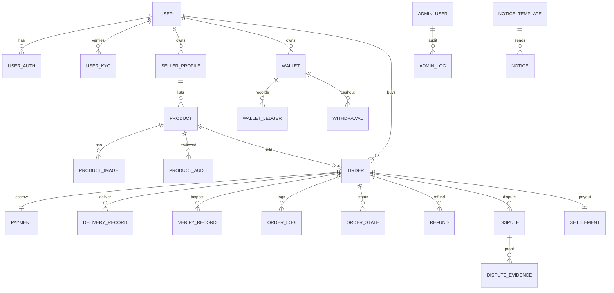

# IDC 二手服务器交易平台 — 一期架构与接口草稿

> 基于《开发文档 V1.0（2026-03-13）》梳理，一期目标是跑通“担保交易闭环”。技术栈按推荐方案 A（NestJS + Next.js + PostgreSQL + Redis）。如需切换到方案 B（Laravel + MySQL），数据模型与接口保持兼容。

## 1. 领域模型 & ERD

### 关键表字段（摘要）
- `user`: id, email, password_hash, status, role (buyer/seller), mfa_enabled, created_at
- `user_auth`: user_id, provider(email/password/otp), last_login_ip, last_login_at
- `user_kyc`: user_id, real_name, id_number, doc_images, status(pending/approved/rejected), reason
- `seller_profile`: user_id, level, stats(trade_count, dispute_rate, avg_delivery_minutes)
- `product`: id, seller_id, title, code, category, region, datacenter, line_type, cpu_model, cpu_cores, memory_gb, disk_gb, disk_type, bandwidth_mbps, traffic_limit, ip_count, ddos, purchase_price, sale_price, renew_price, expire_at, negotiable, consignment, risk_level, delivery_type, can_change_email, can_change_realname, description, status(draft/pending/online/offline)
- `product_audit`: product_id, admin_id, status, reason, snapshot
- `order`: id, buyer_id, seller_id, product_id, price, fee, pay_channel, pay_status, escrow_amount, status, expires_at, auto_confirm_at
- `payment`: order_id, channel, trade_no, pay_amount, pay_status, paid_at, notify_payload
- `delivery_record`: order_id, provider_account, panel_url, login_info(masked), change_email_possible, change_realname_possible, remark
- `verify_record`: order_id, verifier(admin), result(pass/fail/need_more), checklist(cpu/mem/disk/bandwidth/expire_at/abuse_history)
- `settlement`: order_id, seller_id, amount, fee, released_at, status
- `refund`: order_id, applicant, reason, amount, status
- `dispute`: order_id, initiator(buyer/seller/admin), status, result, resolution
- `wallet`: user_id, balance, frozen
- `wallet_ledger`: wallet_id, type(pay/escrow_release/refund/withdraw/fee), amount, ref_id(order/withdrawal), memo
- `withdrawal`: wallet_id, amount, fee, channel, account_info, status, processed_at
- `notice`: user_id, type, channel(site/email/tg), template_id, payload, sent_at, status
- `order_log`: order_id, action, actor(user/admin/system), remark, created_at

## 2. 订单状态机（一期）
- 待支付 → 已支付待交付 → 平台核验中 → 买家验机中 → 已完成待结算 → 已完成
- 支路：退款中、纠纷中；任意阶段进入“纠纷中”后需仲裁，可能回退或关闭。
- 自动任务：支付后 N 小时未交付→提醒/取消；验机超时→自动确认；结算前风控复查。

## 3. 前台 BFF 接口草案（REST）
- Auth：`POST /auth/register`, `POST /auth/login`, `POST /auth/forgot`, `POST /auth/otp/verify`
- Profile：`GET/PUT /user/profile`, `POST /user/kyc`, `GET /user/security/logs`
- Product：`GET /products`, `GET /products/{id}`, `POST /seller/products`, `PUT /seller/products/{id}`, `POST /seller/products/{id}/submit`
- Order：`POST /orders`(下单), `GET /orders/{id}`, `POST /orders/{id}/pay`, `POST /orders/{id}/cancel`
- Delivery & 验机：`POST /orders/{id}/deliver`, `POST /orders/{id}/verify-submit`, `POST /orders/{id}/confirm`
- Refund / Dispute：`POST /orders/{id}/refund`, `POST /orders/{id}/dispute`, `GET /orders/{id}/timeline`
- Wallet：`GET /wallet`, `GET /wallet/ledger`, `POST /wallet/withdraw`
- Notice：`GET /notices`, `POST /notices/read`

## 4. 后台 Admin API 草案
- 登录与权限：`POST /admin/login`, RBAC 中间件；菜单/资源基于角色。
- 用户与认证：`GET /admin/users`, `PUT /admin/users/{id}/ban`, `PUT /admin/users/{id}/kyc`
- 商品审核：`GET /admin/products/pending`, `PUT /admin/products/{id}/audit`
- 订单与担保：`GET /admin/orders`, `PUT /admin/orders/{id}/verify`, `PUT /admin/orders/{id}/force-complete`
- 财务：`GET /admin/settlements`, `PUT /admin/settlements/{id}/release`, `GET /admin/withdrawals`, `PUT /admin/withdrawals/{id}/review`
- 退款/纠纷：`GET /admin/refunds`, `PUT /admin/refunds/{id}/decision`, `GET /admin/disputes`, `PUT /admin/disputes/{id}/decision`
- 内容/运营：`CRUD /admin/notices`, `CRUD /admin/banners`, `CRUD /admin/tags`
- 审计：`GET /admin/logs`

## 5. Webhook 与后台任务
- 支付回调：`POST /webhook/payment/{channel}`，验签后写入 `payment`，触发订单状态推进。
- 定时任务：
  - `order:expire-payment` 关闭超时未付单
  - `order:auto-remind-delivery` 支付后提醒卖家
  - `order:auto-confirm` 验机超时自动确认
  - `settlement:release` 放款与对账
  - `withdrawal:process` 打款队列
- 通知任务：统一消息队列（BullMQ），模板驱动站内/邮件/TG。

## 6. 最小交付物（Sprint 1）
- 前台：注册登录、KYC 提交、商品发布与提交审核、商品列表/详情（只读）、下单与支付入口。
- 后台：商品审核、用户列表、基础操作日志。
- 后端：订单状态机（到“已支付待交付”）、支付回调、商品与用户 API、Swagger 文档。

## 7. 下一步执行建议
1) 确认技术栈与部署目标环境（Node 版本、DB/Redis 版本）。
2) 固化 ERD 与状态机到 Prisma/TypeORM schema，生成迁移脚本。
3) 创建代码仓库基础骨架：`apps/api`（NestJS）、`apps/web`（Next.js）、`packages/shared`（DTO/类型）。
4) 输出 Swagger/OpenAPI 雏形，与前端对齐接口字段与状态码。
5) 搭建支付沙箱（支付宝/微信）与邮件服务 Key，完成回调联调。
